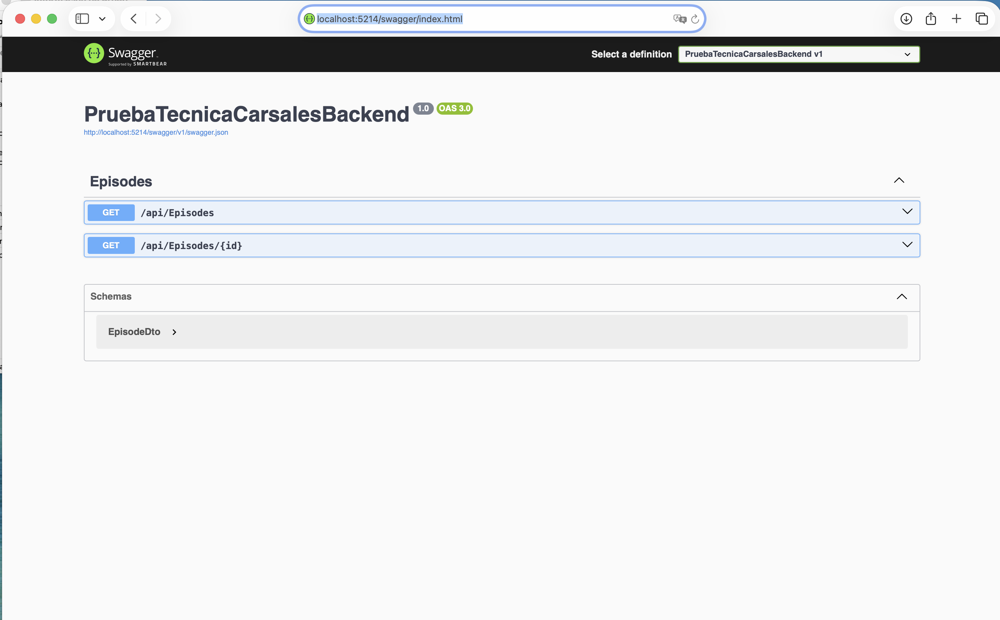
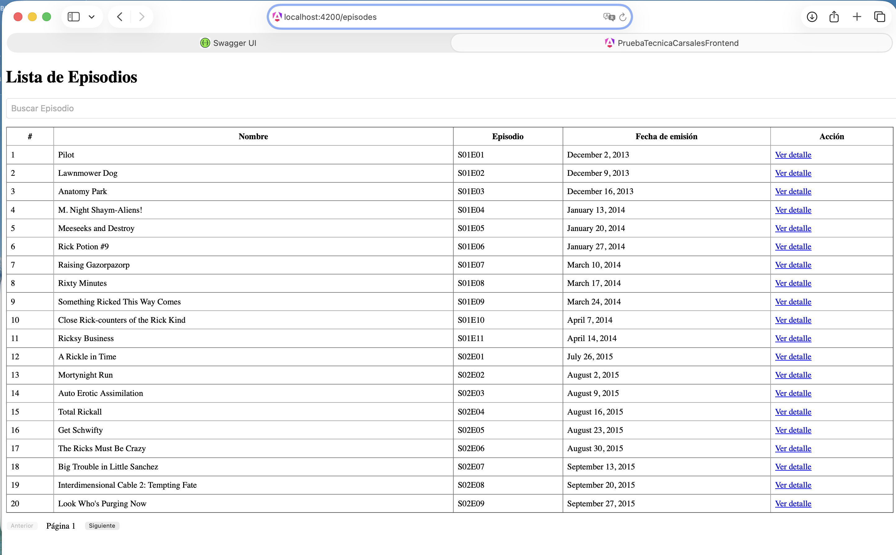
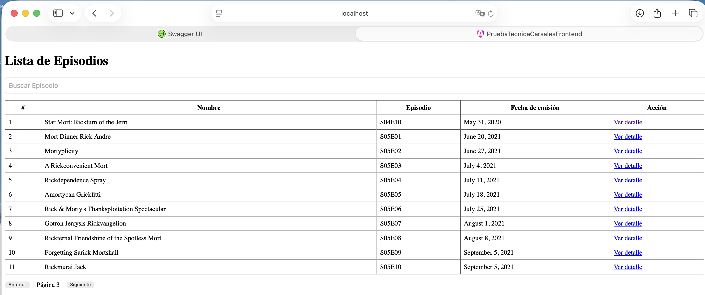
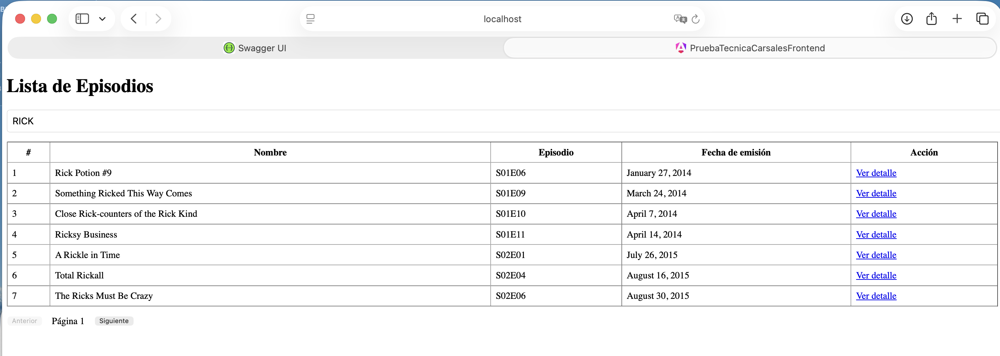
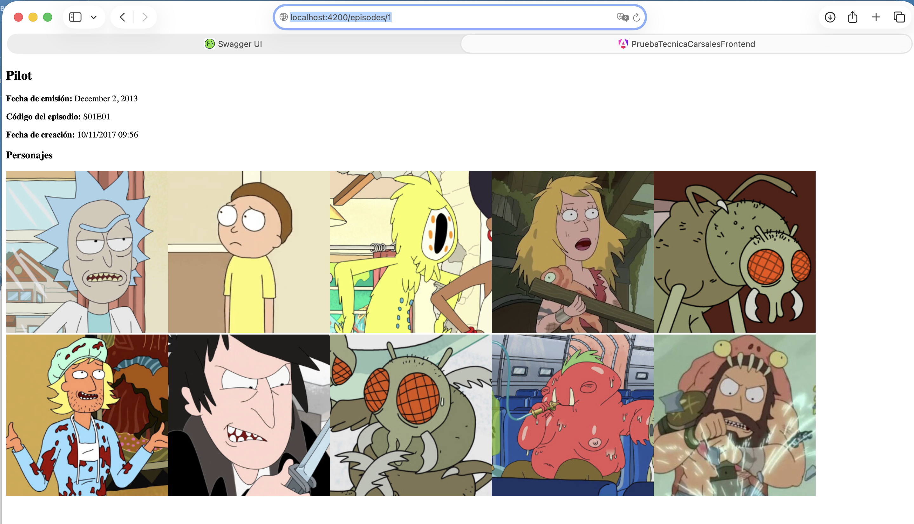

# 🚀 Prueba Técnica Carsales

Aplicación desarrollada como prueba técnica basada en arquitectura **Backend for Frontend (BFF)**, utilizando **.NET 8** para el backend y **Angular 19** para el frontend.

---

## 📘 Descripción General

La aplicación consume la API pública de **Rick and Morty**, mostrando un listado paginado de episodios con sus detalles e imágenes de los personajes.  
Se aplicaron buenas prácticas de arquitectura, principios **SOLID**, tipado fuerte, manejo de errores y uso de las funcionalidades más recientes de **Angular 19** (signals, directivas mejoradas, standalone components).

---

## 🧱 Estructura del Proyecto

```
PruebaTecnicaCarsales/
├── frontend/
│   └── prueba-tecnica-carsales-frontend/
│       ├── angular.json
│       ├── package.json
│       ├── tsconfig.json
│       ├── tsconfig.app.json
│       ├── .editorconfig
│       ├── .gitignore
│       └── src/
│           ├── main.ts
│           ├── index.html
│           ├── styles.css
│           └── app/
│               ├── app.component.ts
│               ├── app.routes.ts
│               ├── app.config.ts
│               ├── app.config.server.ts
│               ├── core/
│               │   ├── models/
│               │   │   └── episode.model.ts
│               │   ├── services/
│               │   │   └── episode.service.ts
│               └── features/
│                   └─ episodes/
│                       ├── state/
│                       │   ├── episode-state.service.ts  
│                       ├── episode-list/
│                       │   ├── episode-list.component.ts
│                       │   └── episode-list.component.html
│                       ├── episode-detail/
│                       │   ├── episode-detail.component.ts
│                       │   └── episode-detail.component.html
│                       └── episode-state.service.ts
│
└── backend/
    └── PruebaTecnicaCarsalesBackend/
        ├── Config/
        │   └── ExternalApisSettings.cs
        ├── Controllers/
        │   └── EpisodesController.cs
        ├── Models/
        │   ├── EpisodeDto.cs
        │   └── EpisodeResponse.cs
        ├── Services/
        │   └── EpisodeService.cs
        ├── Program.cs
        ├── appsettings.json
        ├── appsettings.Development.json
        ├── PruebaTecnicaCarsalesBackend.csproj
        └── Properties/
```

---

## ⚙️ Tecnologías Utilizadas

### 🖥️ Backend (.NET 8)
- ASP.NET Core 8 Web API
- HttpClient para consumo externo
- Inyección de dependencias (DI)
- Configuración mediante `appsettings.json`
- CORS habilitado para comunicación con Angular
- Manejo de excepciones y logs en consola

### 💻 Frontend (Angular 19)
- Standalone Components por defecto
- Signals API y directivas mejoradas (@for, @if, @defer)
- HttpClient con Fetch API
- Enrutamiento con `provideRouter`
- Paginación con Signals
- Arquitectura de estado `EpisodeStateService`
- SSR (Server-Side Rendering)
- Hidratación automática del estado en el cliente

---

## 🧠 Arquitectura BFF

El patrón **Backend for Frontend (BFF)** se utilizó para intermediar entre la API pública de Rick and Morty y el cliente Angular.

```
Angular App → BFF (.NET 8 API) → Rick and Morty Public API
```

Ventajas:
- Control total sobre los datos entregados al frontend.
- Posibilidad de agregar lógica adicional (paginación, caching, seguridad).
- Reducción de acoplamiento entre frontend y servicios externos.

---

## 🚀 Instrucciones de Ejecución

### 🧩 1. Clonar el Repositorio

```bash
git clone https://github.com/usuario/PruebaTecnicaCarsales.git
cd PruebaTecnicaCarsales
```

### 🧠 2. Configuración Backend

Archivo `appsettings.json`:

```json
{
  "ExternalApisSettings": {
    "EpisodesApiBaseUrl": "https://rickandmortyapi.com/api/episode"
  },
  "AllowedHosts": "*"
}
```

### ⚙️ 3. Levantar el Backend (.NET 8)

```bash
cd backend/PruebaTecnicaCarsalesBackend
dotnet restore
dotnet run
```

El backend quedará disponible en:
```
http://localhost:5214/swagger/index.html
```

Los endpoints disponibles son los siguientes:

Listado de Episodios
```
http://localhost:5214/api/Episodes?page=1
```

Episodio Individual

```
http://localhost:5214/api/Episodes/1
```

---

### 🧠 4. Configuración Frontend

Archivo `environment.ts`:

```
export const environment = {
  production: false,
  apiUrl: 'http://localhost:5214/api' 
};
```


### 🌐 5. Levantar el Frontend (Angular 19)

```bash
cd frontend/prueba-tecnica-carsales-frontend
npm install
npm start
```

Luego abre en tu navegador:
```
http://localhost:4200
```

---

## 🧾 Funcionalidades

✅ Listado de episodios con paginación y busqueda por nombre
✅ Visualización de detalle de cada episodio con imágenes de personajes  
✅ Manejo de errores en backend y frontend  
✅ Tipado fuerte en todas las capas  
✅ Arquitectura escalable con separación por responsabilidades  

---

## 🖼️ Capturas del Proyecto

_Aquí puedes insertar imágenes descriptivas del frontend y backend._

### 📸 Vista WebApi Backend


### 📸 Vista de la lista de episodios




### 📸 Vista del detalle del episodio


---

## 🧑‍💻 Autor

**Rodrigo Pavez**  
Desarrollador Frontend & Mobile  
Especializado en Angular, React, Swift, Kotlin y .NET.

📧 Contacto: [ron.pavezb@gmail.com]

---

## 🏁 Licencia

Proyecto de uso libre para fines educativos o demostrativos.
